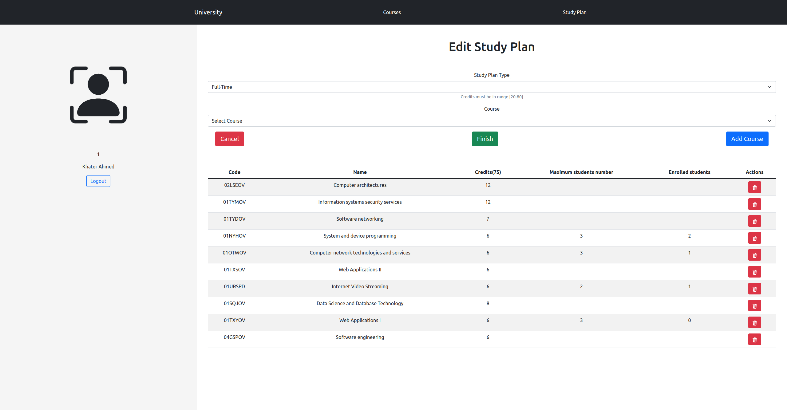

# Exam #12345: "Study plan"

## Student: s294633 Khater Ahmed Mohamed Abdelkhalek

## React Client Application Routes

- Route `/`: Main route to the application, used to redirect users to other pages based on if they are logged in or not.
- Route `/login`: Login page, to authenticate users.
- Route `/students/:studentId/studyPlan`: Personal page of the logged in user, contains the study plan or the option to create one, parameter: `user.code`, parent of (`create`, `edit`).
- Route `/students/:studentId/studyPlan/create`: Contains the form to create a new study plan, parameter: `user.code`, child of (`/students/:studentId/studyPlan`).
- Route `/students/:studentId/studyPlan/edit`: Contains the form to edit current study plan, parameter: `user.code`, child of (`/students/:studentId/studyPlan`).
- Route `/courses`: Contains the list of all available courses in the university.
- Route `*`: Matches any other URLs to inform the user that the URL is not valid.

## API Server

### **_List courses_**

GET `/api/courses`

- Retrieve a list of all available courses
- Request body: _None_
- Response: `200 OK` (success).
- Response body:

```json
[
  {
    "code": "02LSEOV",
    "name": "Computer architectures",
    "credits": 12,
    "preparatoryCourse": null,
    "maxStudentsNumber": null,
    "incompatibleCourses": [
      "02GOLOV"
    ],
    "enrolledStudents": [
      {
        "code": 1,
        "name": "Ahmed",
        "surname": "Khater"
      },
      ....
    ]
  },
  {
    "code": "04GSPOV",
    "name": "Software engineering",
    "credits": 6,
    "preparatoryCourse": "02LSEOV",
    "maxStudentsNumber": null,
    "incompatibleCourses": [
      "05BIDOV"
    ],
    "enrolledStudents": [
      {
        "code": 1,
        "name": "Ahmed",
        "surname": "Khater"
      },
      ....
    ]
  }
]

```

- Error Responses:`500 Internal server error` (generic server error).

### **_Get student's study plan_**

GET `/api/students/:studentCode/:studyPlanId`

- Get study plan of a specific student.
- Parameters: `studentCode`, `studyPlanId`
- Request body: _None_
- Response: `200 OK` (success).
- Response body:

```json
{
  "id": 1,
  "type": "Part-Time",
  "credits": 30,
  "courses": [
    {
      "code": "02LSEOV",
      "name": "Computer architectures",
      "credits": 12,
      "preparatoryCourse": null,
      "maxStudentsNumber": null,
      "incompatibleCourses": [
        "02GOLOV"
      ],
      "enrolledStudents": [
        {
          "code": 1,
          "name": "Ahmed",
          "surname": "Khater"
        },
        ....
      ]
    },
    {
      "code": "04GSPOV",
      "name": "Software engineering",
      "credits": 6,
      "preparatoryCourse": "02LSEOV",
      "maxStudentsNumber": null,
      "incompatibleCourses": [
        "05BIDOV"
      ],
      "enrolledStudents": [
        {
          "code": 1,
          "name": "Ahmed",
          "surname": "Khater"
        },
        ....
      ]
    },
  ]
}

```

- Error Responses: `500 Internal server error` (generic server error).

### **_Create a new study plan_**

POST `/api/students/:studentCode/studyPlan`

- Create a new study plan for a student identified by his code.
- Parameters: `studentCode`.
- Request body:

```json
{
  "type": "full time",
  "credits": 60,
  "courses": [
    {
      "code": "02LSEOV",
      "name": "Computer architectures",
      "credits": 12,
      "preparatoryCourse": null,
      "maxStudentsNumber": null,
      "incompatibleCourses": [
        "02GOLOV"
      ],
      "enrolledStudents": [
        {
          "code": 1,
          "name": "Ahmed",
          "surname": "Khater"
        },
        ....
      ]
    },
    {
      "code": "04GSPOV",
      "name": "Software engineering",
      "credits": 6,
      "preparatoryCourse": "02LSEOV",
      "maxStudentsNumber": null,
      "incompatibleCourses": [
        "05BIDOV"
      ],
      "enrolledStudents": [
        {
          "code": 1,
          "name": "Ahmed",
          "surname": "Khater"
        },
        ....
      ]
    },
  ]
}
```

- Response: `201 Created` (success).
- Response body:

```json
{
  "studyPlanId": 1,
}
```

- Error Responses:`500 Internal Server Error` (generic server error).

### **_Edit study plan_**

PUT `/api/students/:studentCode/studyPlan`

- Update study plan for a specific student identified by his code, can update the `type` or `add or remove courses`.
- Parameters: `studentCode`.
- Request body:

```json
{
  "id": 1,
  "type": "full time",
  "credits": 60,
  "courses": [
    {
      "code": "02LSEOV",
      "name": "Computer architectures",
      "credits": 12,
      "preparatoryCourse": null,
      "maxStudentsNumber": null,
      "incompatibleCourses": [
        "02GOLOV"
      ],
      "enrolledStudents": [
        {
          "code": 1,
          "name": "Ahmed",
          "surname": "Khater"
        },
        ....
      ]
    },
    {
      "code": "04GSPOV",
      "name": "Software engineering",
      "credits": 6,
      "preparatoryCourse": "02LSEOV",
      "maxStudentsNumber": null,
      "incompatibleCourses": [
        "05BIDOV"
      ],
      "enrolledStudents": [
        {
          "code": 1,
          "name": "Ahmed",
          "surname": "Khater"
        },
        ....
      ]
    },
  ]
}
```

- Response: `200 OK` (success).
- Response body: _None_
- Error Responses: `500 Internal server error` (generic error).

### **_Delete study plan_**

DELETE `/api/students/:studentCode/:studyPlanId`

- Delete study plan for a specific student given his code, and study plan ID.
- Parameters: `studentCode`, `studyPlanId`.
- Request body: _None_
- Response: `204 No content` (success).
- Response body: _None_
- Error Responses: `500 Internal server error` (generic error).

### **_Get a student by student's code_**

GET `/api/students/:studentCode`

- Retrive student's information by his code.
- Request body: _None_
- Response: `200 OK` (success).
- Response body: _None_
- Error Responses: `500 Internal server error` (generic error).

## Database Tables

- Table `STUDENT` - contains (<u>`CODE`</u>, `EMAIL`, `NAME`, `SURNAME`, `STUDYPLAN_ID`, `PASSWORD`)
- Table `STUDYPLAN` - contains (<u>`ID`</u>, `TYPE`, `CREDITS`)
- Table `COURSE` - contains (<u>`CODE`</u>, `NAME`, `DESCRIPTION`, `CREDITS`, `PREPARATORY_COURSE_CODE`, `MAX_STUDENT_NUMBER`)
- Table `STUDYPLAN_COURSE` contains (<u>`STUDYPLAN_ID`</u>, <u>`COURSE_CODE`</u>)
- Table `INCOMPATIBLE_COURSE` contains (<u>`COURSE_CODE`</u>, <u>`INCOMPATIBLE_COURSE_CODE`</u>)

## Main React Components

- All Routes components are in `StudyPlanViews.js`
- `<LoginForm/>` (in `LoginForm.js`): manges displaying the form for the login operation.
- `<Navigation/>` (in `Navigation.js`): manages navigation between routes depending on logged in state.
- `<Courses/>` (in `Courses.js`): Wraps other smaller components `<SingleCourse/>` used in managing the display on university available courses for all users.
- `<SingleCourse/>` (in `SingleCourse.js`): Manages the display of each single course data.
- `<PersonalPageLayout/>` (in `PersonalPageLayout.js`): Used in the parent route for the student page, containes the fixed  elements of the student's page and a reserved place to render child coponents.
- `<LogoutButton/>` (in `LogoutButton.js`): Uses in `<PersonalPageLayout/>` to render the logout button.
- `<PersonalStudyPlan/>` (in `PersonalStudyPlan.js`): Used to render the study plan table `<StudyPlanTable/>` and its avaliable actions `<StudyPlanActions/>`,and the option to create a new study plan `<AddStudyPlanButton/>` if one doesn't exist.
- `<StudyPlanActions/>` (in `StudyPlanActions.js`): Contains the buttons that perform the delete and edit study plan actions.
- `<AddStudyPlanButton/>` (in `AddStudyPlanButton.js`): Contains the button to perform the creation of the a new study plan.
- `<CreateStudyPlan/>` (in `CreateStudyPlan.js`): Contains the form and methods used to create or edit the study plan based on the recieved props.
- `<StudyPlanTable/>` (in `StudyPlanTable.js`): Creates the main table structure and uses `<StudyPlanCourseRow/>` for rach course in the study plan.
- `<StudyPlanCourseRow/>` (in `StudyPlanCourseRow.js`): Creates a row in the `<StudyPlanTable/>` containing `<CourseData/>`
- `<CourseData/>` (in `CourseData.js`): Displays the course data and actions depending on the recieved props.

## Screenshot



## Users Credentials

- student1@studenti.polito.it, password, (Full-Time)
- student2@studenti.polito.it, password, (Part-Time)
- student3@studenti.polito.it, password, (Part-Time)
- student4@studenti.polito.it, password, (Full-Time)
- student5@studenti.polito.it, password, (Full-Time)
